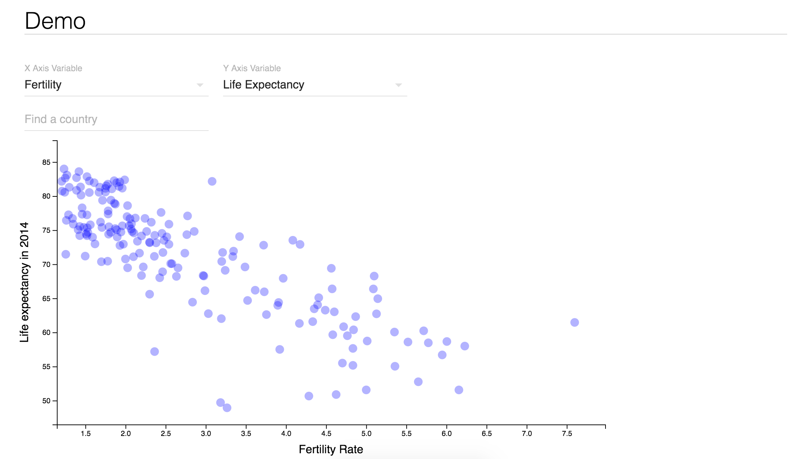

# Demo-1
This exercise demonstrates the use of D3 in conjunction with react. Because this project was bootstrapped with [Create React App](https://github.com/facebookincubator/create-react-app), you'll need to run `npm install` inside the project directory to install necessary packages. Then start your server by running `npm start`.

It looks like this:

